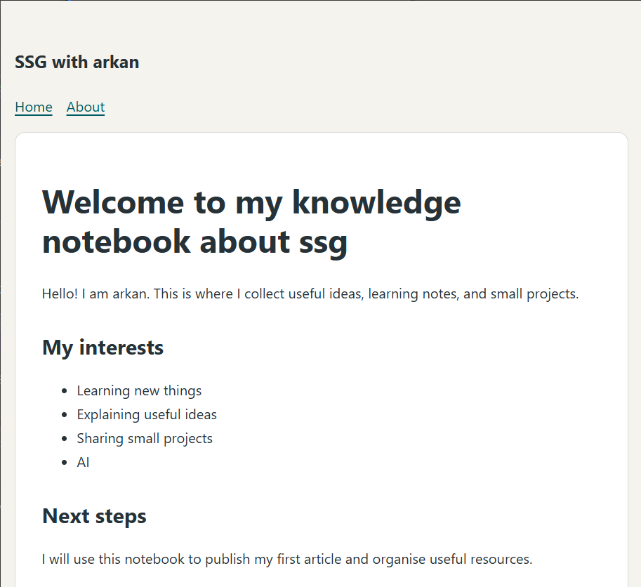

Today I learned how to change a page in my knowledge notebook.

## What I tried

I edited my introduction, saved the file, and checked the local preview.

## What I learned

The words on the page come from a content file that I can edit.


I can consult the [Hugo documentation](https://gohugo.io/documentation/) when I need help.


## My next step

I will write another short note about something I can explain clearly.

[Jump to my next step](#my-next-step)


## My notebook in the browser



*My home page after editing the introduction. Screenshot by the author.*

```text
hugo server -D
```


[Return to my home page](../../)
